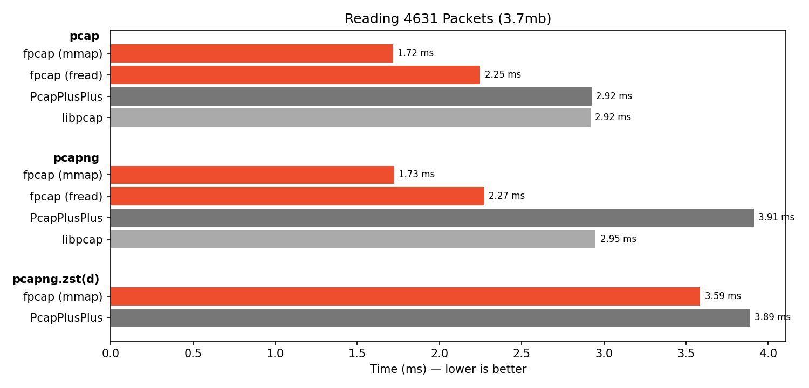

# fpcap-benchmark

Benchmark for fpcap - "A fast and lightweight PCAP file reading library"

## Build

### Windows

Download Npcap SDK and Installer from https://npcap.com/#download

Run the Npcap installer and unpack the SDK and add the directory to your PATH.

Get zstd, unpack and add it to PATH https://github.com/facebook/zstd/releases/tag/v1.5.7

Run CMake with:

```
-DPCAP_ROOT=C:\npcap-sdk-1.16 -DZSTD_ROOT=C:\zstd-v1.5.7-win64 -DZSTD_LIBRARY=C:\zstd-v1.5.7-win64\dll\libzstd.dll.a
```

## Disabling CPU Frequency Scaling

If you see this error:

```
***WARNING*** CPU scaling is enabled, the benchmark real time measurements may be noisy and will incur extra overhead.
```

you might want to disable the CPU frequency scaling while running the benchmark. Exactly how to do this depends on the
Linux distribution, desktop environment, and installed programs.

One simple option is to use the `cpupower` program to change the performance governor to "performance". This tool is
maintained along with the Linux kernel and provided by your distribution.

It must be run as root, like this:

```bash
sudo cpupower frequency-set --governor performance
```

After this you can verify that all CPUs are using the performance governor by running this command:

```bash
cpupower frequency-info -o proc
```

The benchmarks you subsequently run will have less variance.

Note that changing the governor in this way will not persist across reboots. To set the governor back, run the first
command again with the governor your system usually runs with, which varies.

If you find yourself doing this often, there are probably better options than running the commands above. Some
approaches allow you to do this without root access, or by using a GUI, etc. The Arch
Wiki [Cpu frequency scaling](https://wiki.archlinux.org/title/CPU_frequency_scaling) page is a good place to start
looking for options.

## Benchmark results

### 08.02.2026

FPCAP v0.2.0, PcapPlusPlus v25.05, Npcap 1.87

Windows 11, Intel i9-12900KS, 64gb


